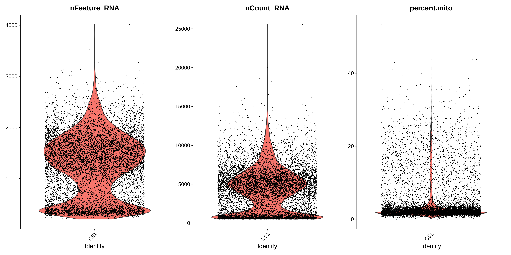
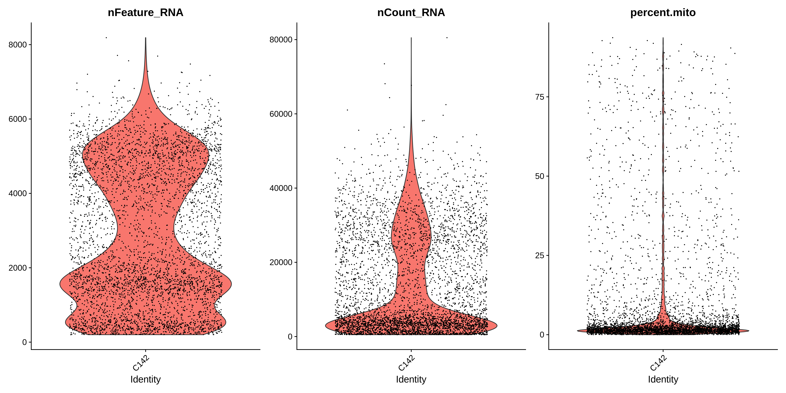
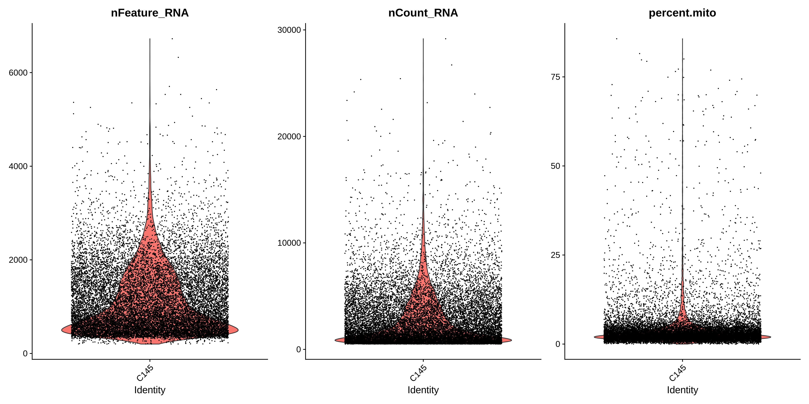
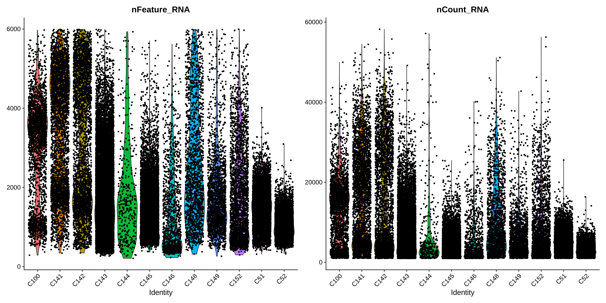

### Singlecellstudy
Project (Soongsil University Graduate Study) and TIL(Today I Learned) on single cell

## COVID project 

- Author: Jiwon Kim 
- For Soongsil University Single Cell sequencing analysis graduate course (under Prof. Junil Kim) 
- Paper/ Data Reference: <br>
[Single-cell landscampe of bronchoalveolar immune cells in patients with COVID-19](https://www.nature.com/articles/s41591-020-0901-9)
- Data that is ready to be analyzed is in data/ in h5 format
	- TCR-seq is out of scope in this analysis report.
	- A normal subject (GSM3660650) has not been included in the analysis. 
- Metadata containing patient (stratification into healthy/moderate/severe) and barcode are in the data/ folder. 
- Folder: image directory is broken down into the followings: 
	- pre_qc : Pre-QCed samples 
	- post_qc: Post-QCed samples 

#### Introduction of scRNA sequencing analysis
______________

### Introduction 

<p> <t> COVID-19 is a global pandemic known to be originated from mainland China. 
    SARS-CoV2 virus is known to infect respiratory tract, first. Infected individuals have exhibited a large range of symptoms. Those symptoms are known to point to differential immune response (Paces <em>et al.</em> 2020). 
    However, a high-resolution respiratory immune landscape is largely unknown. Since brochoalveolar alvage fluid (BAL) mirrors local immune landscape, they have attempted to do single-cell sequencing on it to three subject populations: healthy control, moderately illed, and severely- illed. With the carefully laid-out definitions of severeity, they have sequenced BAL of a total of 13 patients including 3 healthy control subjects. 

### Method 
#### QC & Integration
________________
- QC was done accordingly to the paper 
    - Minimum RNA Features = 200
    - Maximum RNA Features = 6000
    - Required counts of RNA = 1000
    - Maximum mito. cut-off = 10
- Integration was also done accordingly to the paper (first 50 dimensions)
<p>
    
```R
# Of which have been QC(filtered), 
all <- c(healthy.df.filtered, moderate.df.filtered, severe.df.filtered)
nCoV <- FindIntegrationAnchors(object.list = all, dims = 1:50)
nCoV.integrated <- IntegrateData(anchorset = nCoV, dims = 1:50,features.to.integrate = rownames(nCoV))
```

#### Clustering 
________________
- Clustering was done accordingly to the paper 
    - Normalization using 'LogNormalize' method 
    - 'vst' method to identify top 2000 variable genes 
    - Scaling was done with variables 'nCount_RNA' and 'percent'mito'.


### Results: 
_______
<br>

##### Observation of Pre-QC
______________
<p> After downloading the files (h5 format), I have looked at the raw distribution of (1) number of RNA features (2) number of RNA (reads) counts (3) percentage of mitochondria across samples. </p>
I have noticed the followings: <p> 
Normal people (corresponding to the C51, C52, and C100) all have distinct bimodal distribution of RNA feature numbers. On the other hands, COVID-19 infected people have variable distributions. Although it would be nice to do statistical test on the distribution shape (manifold?), I have not done the analysis. <p>
For three moderately infected patients (C141, C142, C144), I have noted that highly diverse distributions of RNA features; from bimodal to long-tailed distribution really close to 0. 
The rest of samples (N = 6) are severely illed patients. Note the general skewed distribution close to 0. Also, RNAs (in terms of both frequencies and kinds) are very diverse, observing from a lot of points concentrated at the bottom for severely illed patients.  </p>




 


### Observation of Integration and Post-QC 
<p> After post-QC and integration, a landscape of RNA features and read counts across subjects has changed greatly. 
    Distinct bi-modal distribution of RNA feature numbers has disappeared from the normal subjects data. Except for one subject (i.e. C100), fairly uniform distributions for both RNA feature numbers and frequencies were observed. On the other hands, bi-modal distribution was seen on moderately illed patients for both RNA feature numbers and frequencies (except for one subject). Increased diversities had been observed in severely illed patients. </p>
    <br> 




